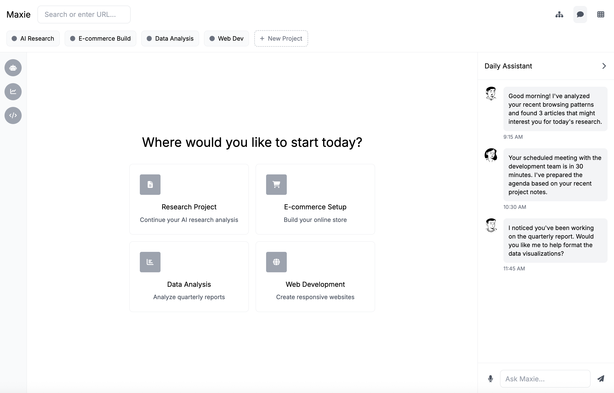

# AI Browser - Maxie

<!-- Notion page icon: 🌎 · Cover image (remote Unsplash): https://images.unsplash.com/photo-1498084393753-b411b2d26b34?ixlib=rb-4.1.0&q=85&fm=jpg&crop=entropy&cs=srgb -->

### Conceptualizing the Future of Browsing

PS : ChatGPT is used for **rephrasing** the words only, ideas and concept is patented to Garvit.

# **Problem Statement**

Knowledge workers spend most of the hours daily in browsers, yet browsers are still fundamentally designed for passive consumption rather than active work. We haven't seen much innovation in the product even after all the apps choosing web as a platform instead of desktop applications.

Even new age browsers like [Comet by Perplexity](https://www.perplexity.ai/comet) and [Dia by Browser Company](https://www.diabrowser.com/) have just brought AI chat in the browser sidebar. Whereas, with the world moving towards Agentic future we can see browser as a partner with Human-in-control. We need a browser to tackle the problems like:

1. **Cognitive load and Chaotic tab management:** Users have 20+ tabs opened with no or manual organization and research says 67% of professionals lose productive time daily just trying to relocate information they viewed earlier.
2. **Information Isolation Across Tools and Time:** The browser sits at the center of knowledge work but maintains no persistent memory/context of user insights, discoveries, or work patterns and treats each page as an isolated entity. When users encounter similar problems weeks later, they start research from zero despite having solved related challenges previously.
3. **Lack of automation control:** Despite the web becoming the primary platform for business tools, browsers provide zero automation capabilities. Knowledge workers manually repeat the same multi-step workflows daily—checking dashboards, updating spreadsheets, monitoring competitor pricing, generating reports.

---

## Vision

*Maxie is transforming the browser from a passive consumption tool into an intelligent digital partner that amplifies human capabilities.*

The vision is to create an AI-powered browser that serves as a true extension of your thinking process - remembering what you've learned, organizing information contextually, and automating repetitive workflows with human oversight. Maxie doesn't just help you browse; it helps you accomplish your goals with less friction and cognitive load.

---

## Assumptions and Clarifications

<!-- The following four blocks are open toggles in Notion -->

**WHO**

- **Who are the primary users here?** The major focus will be on the knowledge professionals (e.g. PMs, analysts, consultants, researchers), developers and data workers.
- **What are the major JTBD (jobs to be done) you can think of for the primary users?** Summarize, compare, and decide; automate repeated web workflows; extract web data; evaluate APIs or local web; test and monitor.
- **Any demographic constraints?** No, universally applicable.

**WHAT**

- **What does "AI browser" mean?** Bringing the power of Agentic AI to smoothen the browsing experience and taking off the cognitive load from the user.
- **Do we have competitors?** No direct competitors since the market is brewing but here is the list of browsers which are close to what we are building: [Fellou](https://fellou.ai/), [Comet](https://www.perplexity.ai/comet), [Dia](https://www.diabrowser.com/), [Brave Leo](https://brave.com/leo/), [Agent Browser by BrightData](https://brightdata.com/ai/agent-browser), [Operator](https://operator.chatgpt.com/), [Sigma](https://www.sigmabrowser.com/), [BrowserBase](https://www.browserbase.com/), [DoBrowser](https://www.dobrowser.io/), [Opera Neon](https://www.operaneon.com/)
- **Budget constraints?** Assume no strict budget constraints.
- **Platform?** Web or app-based.

**WHY**

- **Business goal?** Improve the current operations, retention, and productive revenue model

**WHEN**

- **Any timeline?** Not as of now but MVP within 6 months

---

## Product Features

**Summary**

Maxie solves the productivity crisis in web-based work through three intelligent systems: contextual memory that transforms chaotic tabs into organized project workspaces with persistent research history, trainable agents that automate repetitive workflows across any web platform while learning your specific work patterns, and a collaborative marketplace where teams can share and monetize proven automation workflows. The goal is to create a browser that becomes exponentially more valuable with every task you complete.

### **Intelligent Tab Management and Contextual Memory**

*Transform the chaos of multiple tabs into organized, purposeful research spaces. All your knowledge at your fingertips.*

- **Auto-Grouping and Projects:** Browser automatically creates relevant projects for you based on the browsing history, mails etc. and extract the useful information for quick view along with an option to revisit in depth.
  These projects can create summaries, charts, graphical presentations and be useful to you whenever you need them along with features such as [NotebookLM](https://notebooklm.google) i.e. chatgpt for what you have visited.
- **Visual Browsing Tree:** See your browsing path as a mind map, making it easy to retrace research threads and help get more organized. The browser will create forecast branches which you should visit, helping you navigate through the information.
- **Persistent Intelligence:** AI powered intelligence that understands the context of your work across time, tools, and sessions - eliminating the need to constantly rebuild your mental model.

### **Agent Builder and Marketplace**

*I envision agents to replace the traditional browser extensions, so there would be an agent builder with pre-defined protocols where you can build an agent, say, for your SaaS product's assistance within the browser.*

- **Workflows and Agents training:** Once you have built (or bought from marketplace) an agent through simple prompts and options to choose from, your agent will be trained on the basis of how you work for a specific task where you would be guiding the agent. You can feed in various inputs which will include: DOM, vision, voice, files, APIs, recording a workflow and device context. Agents will ask you questions on the go to understand you better.
- **Marketplace:** You can trade your agents for the betterment of your teams/world in the browser's own marketplace. These agents can be bought through one-time or subscription based payments. You can share the agents across your organization only too.
- **Example:** Say, you are a frontend developer who needs to deploy daily. Although your QA team runs a daily sanity and regression for testing but you need to dev test the changes too. But with Maxie, you can train an agent on your local frontend which helps you with dev testing and sends you a report.

### **Agents with Self or Guided Training**

*Future is not just using AI for answering questions but to automate your tasks with the help of an AI agent who knows how you do your work.*

- **Daily Assistant:** A daily assistant like in the current AI browsers (Comet, Dia) will be there which will help with all the tasks such as close the tabs, summarizing the page, talking about various pages, asking questions on LLM instead of google etc.
- **In-built Agents:** Maxie will have In-built AI Agents like a **Memory Agent** - An agent which brings suggestions from the available memory from the tabs/docs which you have visited to help you with your current work. Retrieval will show where a fact came from.
- **Training:** Automatic Training and NLP for training will be provided optionally to train the already market ready agents according to your needs while they feed on your data (encrypted to your account) to train themselves and adapt.
- **Agent Linking:** Apart from having the access to the agents, users would be able to connect the agents for a specific task to trigger them whenever required.
  e.g. Summarizer can be linked to mail agent which will send summary of your work to relevant recipients when triggered.

### **Additional Features**

- **Policy & Safety Engine:** Allow/deny rules, spending limits, content categories, and jurisdictional compliance.
- **Verifiable Action Logs:** Run logs, reproducible replays and audit trails.
- **Co-Browsing:** Co-browsing helps you create team wise projects and store your tabs in a shared window.

---

## Differentiation and MOAT

Unlike legacy browsers like Chrome or Safari or new AI browsers like Comet or Dia, Maxie is not just a browser but a companion. There are several MOATs to Maxie including the features such as persistent contextual memory, agents and marketplace.

And all the MOATs are compounding in nature e.g. more the users train agents on Maxie, the better our workflow intelligence becomes across the entire platform. This creates a data moat that's impossible for new competition to replicate. Also, context accumulation creates switching opportunity costs. The longer someone uses Maxie, the more valuable their accumulated browsing context becomes, making migration to competing browsers increasingly costly. Marketplace in itself has deep network effects.

| **Propositions** | **Legacy Browsers (Chrome, Safari, Edge, Firefox)** | **New AI Browsers (Comet, Dia, etc.)** | **Maxie** |
| --- | --- | --- | --- |
| **Core Purpose** | Rendering web pages | Enhanced Search and Easy Access to Information | Active partner that remembers, organizes, and completes tasks |
| **AI Capability** | None | Just a chat window | AI native agents and contextual memory |
| **Tab Management** | Grouping available | Tab context available | Automatic project synthesis from visited tabs along with visual browsing trees |
| **Automation** | None | Limited to single page | Trainable automated agents |
| **Collaboration** | Some Extensions | Limited/no collaboration | Co-Browsing |
| **Extensibility** | Extensions marketplace | Limited | Agent Marketplace (with org-level sharing) |
| **Compounding Value** | Static | Better answers | Browser gets smarter with every project and workflow |

---

## Adoption Strategy

Starting with the Pilot release to validate the usefulness of the features. Also the user experience testing will be done as a part of this release.

- **Initial Target Audience (Pilot Release)**
  - Developers, product managers, analysts, consultants, and researchers.
  - Communities where AI adoption is already high (tech companies, startups, academia).
  - Invite-only beta and waiting list to build exclusivity.
- **Go-to-Market Channels**
  - **Product-Led Growth:** Freemium with strong core features (memory, tab management) that demonstrate value immediately.
  - **Community Engagement:** Partnerships with dev communities (GitHub, Reddit, Product Hunt) and research forums.
  - **Enterprise Pilots:** Secure pilots with consulting firms, research agencies, and SaaS teams to prove ROI.
  - **Content & Advocacy:** Case studies and thought-leadership on "agentic browsers" as the next paradigm shift.
- **Expansion Phase**
  - Introduce agent marketplace to hook teams and enterprises.
  - Deep integrations with productivity tools.
  - Broader marketing to non-technical professionals once traction is built.

---

## Revenue Model

Main source of revenue will be subscription models because of the subscription pricing involved for LLM models. Apart from the subscription other revenue stream will include agent marketplace commission and selling of custom made in-house agents.

**Enterprise plans** will be curated in later phases with custom pricing and service type model instead of a defined product with "Talk to Sales" option enabled.

| **Plans vs Features** | **Free** | **Pro** | **Team** |
| --- | --- | --- | --- |
| **Price** | $0 (1 seat) | $25 (1 seat) | $115 (5 seats) |
| **Limits** | 5 projects + 2 Agents available + No Limit on LLM | Unlimited Projects + Unlimited Agents + Included monthly Cloud AI credits; overage billed usage‑based | Shared Projects + Everything in pro plan with higher AI credits |
| **LLM Options** | Locally installed LLM only (on‑device) | Local, Cloud, or Hybrid | Local, Cloud, or Hybrid |
| **Agents** | Only in-built or local agents supported | All agents supported | All agents supported |
| **MCP connectivity to agents** | No | Yes | Yes |
| **Co-Browsing** | No | No | Yes |
| **Storage for projects and memory** | Limited | Limited | Unlimited |
| **Other Features** | None | Support access | Support Access, SSO (OAuth), Private‑cloud option available |

**Marketplace Revenue:**

- **Commission Model:** 20–30% cut from agent marketplace sales (one-time or subscription-based).
- **Team/Enterprise Credits:** Companies can buy bulk credits for internal agent marketplace usage.

---

## Wireframes

To **view the prototype** which shows the idea of how the browser will look like please click on the embed link given below:

## [Link to Maxie Prototype](https://claude.ai/public/artifacts/8dab7fe9-602d-4307-b116-0b805c664b13)

For quick understanding please refer this:

1. **Left Side Bar:** Contains the agents which are recruited by the user and are clickable for further chat and training options.
2. **Right Side Bar:** Switches between Assistant and Browsing Tree.
3. **Centre:** Main viewport of the browser.
4. **Projects Bar:** Lists all your projects which you can visit for detailed overviews.
5. **Right top corner:** Contains button to switch between assistant, browsing tree or to visit the agent builder and marketplace.

